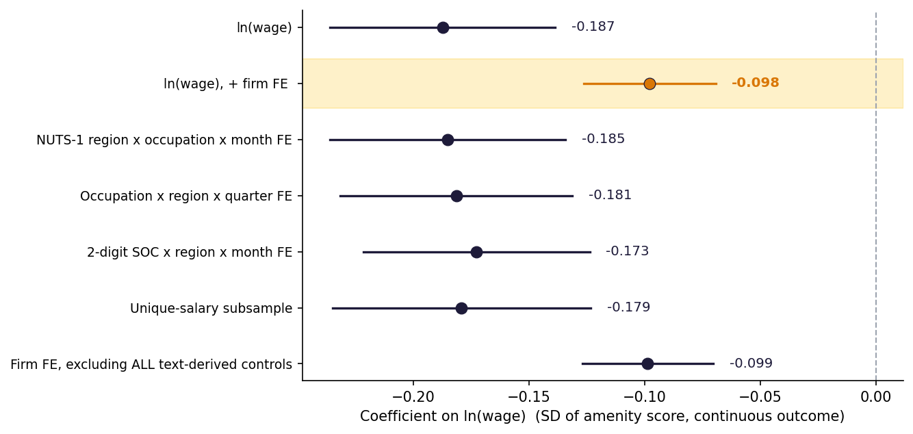

# Do Lower-Wage Job Postings Use More Amenity Language?

NLP and econometric analysis of job amenities in UK vacancy descriptions.

## Overview

Code for Davit Melikjanyan's 2026 Bachelor's thesis at Utrecht University,
BSc Economics and Business Economics, with a Minor in Data Science.
The project combines Sentence-BERT textual measurement with fixed-effects
regression analysis of 178,000+ UK job advertisements.

This repository contains the research code, methodology documentation, and
selected aggregate figures. The private dataset is excluded.

## Research Question

Do lower-wage vacancies use more language about flexibility, workplace culture,
meaningful work, development, and benefits? The analysis examines whether this
pattern is consistent with compensating-differential ideas in labour economics.
It measures advertised language and conditional associations; it does not identify
causal wage–amenity trade-offs or establish employers' intentions.

## Methodology

- **Text measurement:** extract the description segment selected by the original
  code and embed each advertisement body as one input using
  `sentence-transformers/all-MiniLM-L6-v2`. Long inputs are subject to tokenizer
  truncation; advertisements are not split into sentences.
- **Amenity score:** subtract cosine similarity to a centroid of six procedural
  reference sentences from similarity to a centroid of 15 amenity reference
  sentences. Standardise within three-digit occupation × calendar-year cells.
- **Wages and controls:** construct log CPI-adjusted salary, advertisement length,
  salary-range indicators and width, and categorical education, seniority,
  experience, and contract controls.
- **Econometrics:** estimate OLS with occupation × region × year-month fixed
  effects, adding company fixed effects in the preferred model. Standard errors
  are clustered by company using PyFixest's `CRV1` setting.
- **Supporting analyses:** alternative fixed effects and samples, skill-group
  interactions, regional posting density, dictionary-based amenity dimensions,
  manual-rating agreement, exact-duplicate exclusion, and head–tail scoring.

See [methodology](docs/methodology.md) for exact construction rules and
[reproducibility](docs/reproducibility.md) for provenance and limitations.

## Dataset

The analysis uses more than 178,000 UK job advertisements. The underlying
job-advertisement dataset is not included in this repository because of
data-access and redistribution restrictions.

The archived workflow starts with 200,000 advertisements from 2017–2019.
The baseline model uses 178,173 observations; the preferred company-fixed-effects
model uses 168,269. These are different stages of sample construction, not
interchangeable sample sizes. No real or synthetic sample dataset is distributed.

## Repository Structure

```text
job-amenities-nlp/
├── README.md
├── LICENSE
├── .gitignore
├── requirements.txt
├── src/
│   ├── paths.py                    # Private input and local output locations
│   ├── build_amenity_scores.py     # SBERT reconstruction and score comparison
│   ├── thesis_analysis.py          # Main models, checks, tables, and figures
│   ├── sensitivity_common.py       # Shared sensitivity preparation and models
│   ├── duplicate_sensitivity.py    # Exact-duplicate exclusion
│   └── head_tail_sensitivity.py    # Alternative token-window scoring
├── figures/                       # Two reviewed aggregate thesis figures
├── docs/                          # Methodology, inputs, results, release notes
└── scripts/
    └── check_public_release.py    # Data-free Git content and privacy checks
```

Local `data/` and `outputs/` directories are ignored by Git. There are no notebooks,
R scripts, or Stata programs in the source package; Stata is the input file format.

## Analysis Pipeline

1. Supply the authorised raw dataset, archived index-aligned scores, and rated
   validation file locally, following the [input contract](docs/data_contract.md).
2. Reconstruct SBERT scores and compare them with the archived scores. The main
   analysis continues to use the archived file; reconstruction does not replace it.
3. Run `thesis_analysis.py`: construct dates, real wages, controls, score categories,
   market cells, and the estimation sample; then fit the main and robustness models.
4. The same script runs skill, posting-density, dictionary, and validation analyses,
   checks archived numerical targets, and writes tables and figures.
5. Run the duplicate and head–tail sensitivity scripts. Each independently prepares
   its sample and fits the baseline and company-fixed-effects models.

## Technologies

Python, pandas, NumPy, Sentence-Transformers with PyTorch, scikit-learn,
SciPy, PyFixest, and Matplotlib. All regression estimation is implemented in Python.

## Key Findings

The archived results show a negative association between log offered wages and
amenity-language scores, including after adding company fixed effects.
The preferred coefficient is **−0.097784** (company-clustered SE **0.014551**;
95% interval **[−0.126305, −0.069263]**).

Exact-duplicate exclusion changes the preferred estimate little. Using the first
and last 120 model tokens produces a smaller negative estimate, **−0.054363**,
showing that the magnitude is sensitive to the text window. Manual-rating agreement
is modest and potentially affected by non-blinded ratings.
These are archived research results, not estimates rerun for this public release.
See [results and qualifications](docs/results.md).



The highlighted row is the preferred company-fixed-effects specification.
A second figure shows [skill-group slopes](figures/skill_group_slopes.png).

## Running the Code

```bash
git clone https://github.com/devitne9/job-amenities-nlp.git
cd job-amenities-nlp
python -m venv .venv
source .venv/bin/activate
python -m pip install -r requirements.txt
```

On Windows, activate with `.venv\Scripts\activate` in Command Prompt or
`.venv\Scripts\Activate.ps1` in PowerShell. The source package reports Python 3.12
verification, while its saved environment records show Python 3.13.2; there is no
single fully pinned replication environment. See [environment notes](docs/reproducibility.md).

An authorised researcher must create `data/` and supply `adzuna_sample.dta`,
`amenity_scores.csv`, and `validation_sample_RATED.csv` with the exact schemas and
row alignment described in the [input contract](docs/data_contract.md).
Keep these files private. The full analysis cannot run from this checkout alone.

From the repository root, once the authorised inputs are available:

```bash
python src/build_amenity_scores.py --reference data/amenity_scores.csv --device cpu
python src/thesis_analysis.py
python src/duplicate_sensitivity.py
python src/head_tail_sensitivity.py --device cpu
```

Reconstructed scores go to `outputs/amenity_scores_recreated.csv`, main results to
`outputs/thesis/`, and sensitivity results to `outputs/sensitivity/`. All are ignored.
The first SBERT run needs the model weights, which Sentence-Transformers may download.
No advertisement-upload API is used by these scripts. Keep generated outputs local
until their contents have been reviewed.

To check the public files without installing analysis dependencies or supplying data:

```bash
python scripts/check_public_release.py
```

Before committing, also run `python scripts/check_public_release.py --staged` and
inspect `git diff --cached`. Automated checks supplement manual privacy review.

## Thesis Information

**Bachelor's Thesis — Utrecht University**

BSc Economics and Business Economics · Minor in Data Science · 2026

Author: **Davit Melikjanyan**

*Do Lower-Wage Job Postings Use More Amenity Language? Textual Signals and
Compensating Differentials in UK Job Advertisements*

## Data Availability

The original advertisements, scores, validation records, and other observation-level
files are excluded because of data-access and redistribution restrictions. This
repository grants no data access. Reproduction requires independently authorised
access to the original inputs.

## License

The [MIT license](LICENSE) applies to the code in this repository. The underlying
job-advertisement dataset is not distributed and is not covered by this repository
license. No rights to that dataset are granted.
